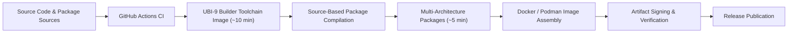

# UBI-9 Multi-Architecture Builder Toolchain

[](https://github.com/lorenzobiosa/container-toolchain/actions/workflows/build-toolchain.yml)
[](https://github.com/lorenzobiosa/container-toolchain/actions/workflows/auto-update.yml)
[](https://github.com/lorenzobiosa/container-toolchain/releases)
[](#)
[](#)
[](#)
[](LICENSE)

## Executive Summary

This project provides a **high-performance, enterprise-grade build system** based on **Red Hat UBI 9** for producing **deterministic, reproducible, cross-architecture packages and container images** for **amd64** and **arm64**.

A core design principle is that **all packages are built from source**, allowing the resulting **Docker/Podman images** to be constructed with **fully controlled, minimal, and auditable software components**, resulting in a supply chain that **drastically reduces vulnerability exposure** and, in practice, approaches **zero known vulnerabilities** at image creation time.

It delivers:

*   **\~10 minutes** to build the complete builder toolchain image
*   **\~5 minutes** to produce multi-architecture packages
*   Source-based package compilation for **clean, minimal, low-vulnerability images**
*   Fully automated **CI/CD**, **artifact signing**, and **verification**
*   Strong security and governance controls
*   Production-ready workflows suitable for regulated and enterprise environments

The system is optimized for **speed, correctness, reproducibility, and security**.
---

## Key Capabilities

| Capability                | Description                                                                      |
| ------------------------- | -------------------------------------------------------------------------------- |
| Cross-Architecture Builds | Native support for **amd64** and **arm64** from the same toolchain               |
| High Performance          | **Builder image \~10 min**, **multi-arch packages \~5 min**                      |
| Source-Based Packages     | All packages compiled from source for maximal control and minimal attack surface |
| Low-Vulnerability Images  | Resulting container images typically approach **zero known vulnerabilities**     |
| Enterprise Base           | Built on **Red Hat UBI 9**                                                       |
| Reproducible Toolchain    | Deterministic tool versions and build layers                                     |
| Security First            | Signed artifacts, verification pipeline, security scanning                       |
| Fully Automated           | CI/CD from source → release without manual steps                                 |
| Production Governance     | Policy enforcement, dependency automation, compliance ready                      |

---

## System Architecture (High Level)



All runtime images are assembled exclusively from packages produced by this pipeline, enabling strict control over every component that enters production.

---

## Why This Project Exists

Traditional build systems struggle with:

*   Long build times for multi-architecture artifacts
*   Reliance on prebuilt binaries with opaque provenance
*   Non-reproducible results across environments
*   Weak supply-chain security and large vulnerability surfaces

This project solves those problems by combining:

*   **UBI-9 enterprise base image**
*   Highly optimized build layers
*   Deterministic, pinned toolchain configuration
*   Full source-based package compilation
*   End-to-end automation of the build → image → release lifecycle

The result is a system capable of producing **fast, reproducible, auditable, and extremely low-vulnerability container images**.

---

## Repository Structure (Key Areas)

| Path                | Responsibility                                   |
| ------------------- | ------------------------------------------------ |
| `/build`            | Builder image definitions and toolchain assembly |
| `/scripts/dev`      | Local developer build workflows                  |
| `/scripts/release`  | Artifact signing and verification                |
| `.github/workflows` | CI/CD pipelines and governance                   |
| `/docs`             | Complete system documentation                    |

---

## Quick Start

### Prerequisites

*   Linux host with: `git`, `jq`, `make`, `gcc`, `g++`, `tar`, `xz`, `gzip`
*   For **arm64** builds: `clang`, `ld.lld`
*   `go` preinstalled (or provided by builder image)
*   For signing/verifying: `cosign`, `syft`, `gpg`

### Build Packages

**Build for amd64:**

```bash
./build-tools.sh linux amd64
# Output: /out/tools-linux-amd64.tar.gz
```

**Build for arm64 (cross-build):**

```bash
./build-tools.sh linux arm64
# Output: /out/tools-linux-arm64.tar.gz
```

Both builds run smoke tests and validate architecture and permissions.

### Sign & Verify Artifacts

**Keyful (BYOK) Example:**

```bash
export OUT_DIR=out
export GPG_PRIVATE_KEY="$(cat ~/.gnupg/private.key)"
export GPG_KEY_ID="YOUR-GPG-KEY-ID"
export COSIGN_PRIVATE_KEY="$(cat cosign.key)"
./sign-and-verify.sh --out-dir "$OUT_DIR" --tag v1.0.0
```

**Keyless (Fulcio/OIDC) Example:**

```bash
export OUT_DIR=out
export GPG_PRIVATE_KEY="$(cat ~/.gnupg/private.key)"
export GPG_KEY_ID="YOUR-GPG-KEY-ID"
export COSIGN_CERT_OIDC_ISSUER="https://token.actions.githubusercontent.com"
export COSIGN_CERT_IDENTITY="your-identity-string-or-regex"
./sign-and-verify.sh --out-dir "$OUT_DIR" --tag v1.0.0
```

Artifacts produced:  
`tools-linux-amd64.tar.gz`, `tools-linux-arm64.tar.gz`, `SHA256SUMS`, `sbom.spdx.json`, `*.cosign.bundle`, `*.tar.gz.asc`, `SHA256SUMS.asc`

### Version Pinning

Edit `/build/config/tool-versions.json` to pin versions for `kubectl`, `oc`, `rancher`, `go`, `fulcio`. Example:

```json
{
  "kubectl": "v1.35.0",
  "oc": "release-4.23",
  "rancher": "v2.13.1",
  "go": "1.25.5",
  "fulcio": "v1.8.4"
}
```

All builds use these pins for reproducibility and security.

---

## Enterprise Guarantees

*   **Reproducible builds**
*   **Cryptographically verified artifacts**
*   **Deterministic toolchain versions**
*   **Source-based package provenance**
*   **Cross-architecture parity**
*   **Extremely low vulnerability container images**
*   **Strong CI/CD governance**
*   **Production auditability**

---

## Documentation

Comprehensive documentation is available in the `/docs` directory:

*   Architecture
*   Build system internals
*   Toolchain design
*   CI/CD lifecycle
*   Security model
*   Release engineering
*   Performance guarantees
*   Operational guidance
*   Governance & compliance

---

## Target Users

*   Platform & Infrastructure Teams
*   DevOps & SRE organizations
*   Enterprise Software Producers
*   Security & Compliance Teams
*   Organizations requiring fast, reproducible, multi-architecture builds with minimal vulnerability exposure

---

## License & Governance

This project follows strict governance, security, and contribution controls suitable for enterprise adoption.

---

**This project establishes a new baseline for secure, high-performance, enterprise-grade multi-architecture build pipelines and low-vulnerability container image production.**

---
