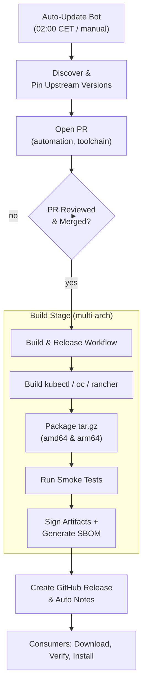

# 🔧 Container Toolchain

[](https://github.com/lorenzobiosa/container-toolchain/actions/workflows/build-toolchain.yml)
[](https://github.com/lorenzobiosa/container-toolchain/actions/workflows/auto-update.yml)
[](https://github.com/lorenzobiosa/container-toolchain/releases)
[](#)
[](#)
[](#)
[](LICENSE)

**Enterprise‑grade CLI toolchain for containerized platforms.**  
Delivers **signed**, **multi‑arch** binaries—**kubectl**, **oc**, **rancher**—as **versioned artifacts** for secure integration into **Container Toolkit** and related projects.  
Built from **trusted source** with **deterministic pins**, **automated updates**, **SBOM (SPDX)**, and **dual signatures** (**Cosign** bundle + **GPG**).

---

## ✅ Key Capabilities

- 🔐 **Signed artifacts**: Cosign bundle + GPG detached signatures.
- ⚙️ **Multi‑architecture**: `linux/amd64` and `linux/arm64`.
- 📌 **Deterministic builds**: centralized pins in `build/config/tool-versions.json`.
- 🤖 **Automated updates**: nightly PRs to bump upstream versions; scheduled builds publish releases.
- 🧾 **SBOM (SPDX JSON)**: generated with Syft for compliance & audit.
- 🚦 **Smoke tests**: post‑build verification (`kubectl/oc/rancher`) to fail fast.

---

## 🧭 End‑to‑End Architecture & Process

### Diagram (high‑level flow)



### Detailed steps

1.  **Version discovery & governance**

    - Nightly **Auto‑Update Bot** (`.github/workflows/auto-update.yml`) or manual trigger:
      - `kubectl` → reads **latest stable** from Kubernetes `stable.txt`. [\[aran.dev\]](https://aran.dev/posts/go-124/go-124-new-tool-directive/)
      - `oc` → resolves **latest tag** from upstream, **fallback** to `main`. [\[alchemists.io\]](https://www.alchemists.io/articles/docker_multi-platform_images/)
      - `rancher` → reads **latest release** via GitHub API, **fallback** to latest tag.
    - Writes pins to **`build/config/tool-versions.json`**; opens a **PR** with labels (`automation,toolchain`).
    - If **no changes**, **no PR** (no waste of builds/releases).

2.  **Build (multi‑arch) & smoke test**

    - Build runs inside **UBI 9** containers (Docker Buildx/QEMU):
      - `kubectl` (stable tag, direct `cmd/kubectl`, **CGO disabled**) for portability. [\[aran.dev\]](https://aran.dev/posts/go-124/go-124-new-tool-directive/)
      - `oc` (**official `make oc`**, modern repo with `go.mod`); **fallback** direct Go build (**CGO enabled**) with native deps: `gpgme-devel`, `libassuan-devel`, `krb5-devel`. [\[alchemists.io\]](https://www.alchemists.io/articles/docker_multi-platform_images/)
      - `rancher` (latest tag/release, **CGO disabled**).
    - The build script runs a **smoke test** after packaging: `kubectl version --client`, `oc version --client`, `rancher --version`.

3.  **Signing, SBOM & local verification**

    - Unified script `scripts/release/sign-and-verify-local.sh`:
      - **Checksums**: `SHA256SUMS`.
      - **SBOM (SPDX JSON)**: generated via **Syft**. [\[docs.redhat.com\]](https://docs.redhat.com/en/documentation/red_hat_enterprise_linux/9/html/building_running_and_managing_containers/assembly_adding-software-to-a-ubi-container_building-running-and-managing-containers)
      - **Cosign** → `sign-blob --bundle` produces **bundled signature** (signature, Fulcio cert, Rekor log metadata). [\[cshen-dev.github.io\]](https://cshen-dev.github.io/posts/choose-a-docker-base-image/)
      - **GPG** → **ASCII detached** signatures (`*.asc`) for artifacts and `SHA256SUMS`.
      - Performs **local verification** (Cosign bundles and GPG).

4.  **Release publishing (GitHub)**

    - The workflow creates a **GitHub Release**, marks as **Latest**, attaches: tar.gz, SBOM, checksums, Cosign bundles, GPG signatures.
    - **Auto‑generated release notes** enabled; **`.github/release.yml`** groups PRs by labels (Features, Bug Fixes, Security, CI/Tooling, Docs; with exclusions e.g., Dependabot). [\[geeksforgeeks.org\]](https://www.geeksforgeeks.org/linux-unix/install-and-set-up-kubectl-on-linux/)

5.  **Consumption (Container Toolkit & others)**
    - Consumers pin a **release tag** and **architecture**, **verify**, and **install** (see Dockerfile example below).

---

## 🧩 Implemented Components (Overview)

- **Version pins** in `build/config/tool-versions.json` (source of truth).
- **Auto‑Update Bot** (PR workflow, nightly 02:00 CET, manual trigger).
- **Multi‑arch builds** (amd64/arm64) in UBI 9 with QEMU/Buildx.
- **Official `oc` build** via `make oc`; automatic fallback for legacy tags. [\[alchemists.io\]](https://www.alchemists.io/articles/docker_multi-platform_images/)
- **Smoke tests** to fail fast post‑build.
- **Unified local signing script** (Cosign bundles + GPG + SBOM + verification). [\[cshen-dev.github.io\]](https://cshen-dev.github.io/posts/choose-a-docker-base-image/), [\[docs.redhat.com\]](https://docs.redhat.com/en/documentation/red_hat_enterprise_linux/9/html/building_running_and_managing_containers/assembly_adding-software-to-a-ubi-container_building-running-and-managing-containers)
- **GitHub Release** (Latest, auto notes, attachments).
- **Auto notes customization** via `.github/release.yml` (categories & exclusions). [\[geeksforgeeks.org\]](https://www.geeksforgeeks.org/linux-unix/install-and-set-up-kubectl-on-linux/)
- **Consumer Dockerfile** snippet to fetch/install with checksum verification.

---

## 📦 Published Artifacts

- **Kubernetes CLI**: `kubectl` (latest **stable**).
- **OpenShift CLI**: `oc` (official `make oc`, fallback direct build, GPGME/CGO).
- **Rancher CLI**: `rancher` (latest upstream release).

> **Roadmap:** Any package requiring **secure rebuild from source** (vulnerable upstream/policy) will be onboarded.

---

## 🔗 Consumer Usage (Dockerfile)

```dockerfile
ARG TOOLCHAIN_TAG=toolchain-2025-12-27
ARG ARCH=amd64

RUN curl -fsSL "https://github.com/lorenzobiosa/container-toolchain/releases/download/${TOOLCHAIN_TAG}/tools-linux-${ARCH}.tar.gz" -o /tmp/tools.tar.gz \
 && curl -fsSL "https://github.com/lorenzobiosa/container-toolchain/releases/download/${TOOLCHAIN_TAG}/SHA256SUMS" -o /tmp/SHA256SUMS \
 && cd /tmp && sha256sum -c SHA256SUMS \
 && tar -xzf tools.tar.gz -C /usr/local/bin \
 && rm -rf /tmp/tools.tar.gz /tmp/SHA256SUMS
```

---

## 🔐 Signing & Verification (Deep Dive)

### Cosign (bundles) — recommended

- **Signing:**  
  `cosign sign-blob --bundle tools-linux-amd64.cosign.bundle tools-linux-amd64.tar.gz`  
  Bundle embeds **signature**, **Fulcio certificate**, and **Rekor transparency log** proof for tamper‑evident provenance. [\[cshen-dev.github.io\]](https://cshen-dev.github.io/posts/choose-a-docker-base-image/)
- **Verification:**
  ```bash
  cosign verify-blob \
    --bundle tools-linux-amd64.cosign.bundle \
    tools-linux-amd64.tar.gz
  ```
- **Key modes:**
  - **Key‑based** (`COSIGN_PRIVATE_KEY` + `COSIGN_PASSWORD`) for deterministic CI.
  - **Keyless OIDC** (`id-token: write`) leveraging runner identity and **Fulcio** + **Rekor**. [\[cshen-dev.github.io\]](https://cshen-dev.github.io/posts/choose-a-docker-base-image/)

### GPG (detached)

- **Signing:** `gpg --armor --detach-sign -u "$GPG_KEY_ID" tools-linux-amd64.tar.gz`
- **Verification:** `gpg --verify tools-linux-amd64.tar.gz.asc tools-linux-amd64.tar.gz`
- **Use cases:** Traditional/offline verification; dual signature provides defense‑in‑depth.

### SBOM (SPDX JSON)

- Generated via **Syft**: `syft dir:./out -o spdx-json=./out/sbom.spdx.json`.
- Ready for ingestion by compliance tooling and audits. [\[docs.redhat.com\]](https://docs.redhat.com/en/documentation/red_hat_enterprise_linux/9/html/building_running_and_managing_containers/assembly_adding-software-to-a-ubi-container_building-running-and-managing-containers)

---

## 📌 Version Pinning (`build/config/tool-versions.json`)

```json
{
  "kubectl": "v1.35.0",
  "oc": "main",
  "rancher": "v2.13.1",
  "go": "1.25.5"
}
```

- `kubectl`: **stable** (`stable.txt`). [\[aran.dev\]](https://aran.dev/posts/go-124/go-124-new-tool-directive/)
- `oc`: **main** or release branch/tag with `make oc`. [\[alchemists.io\]](https://www.alchemists.io/articles/docker_multi-platform_images/)
- `rancher`: upstream **latest** release.
- `go`: **1.25.5** (security release). [\[pkg.go.dev\]](https://pkg.go.dev/github.com/itaysk/kubectl-neat), [\[deepwiki.com\]](https://deepwiki.com/tonistiigi/binfmt/2-getting-started)

---

## 🧪 Local Build, Sign & Test

> Prereqs: Docker/Podman; internet; optional: local keys for signing.

### Build locally

```bash
mkdir -p out

# amd64
docker run --rm --platform linux/amd64 \
  -v "$PWD/out:/out" -v "$PWD/build:/build" \
  registry.access.redhat.com/ubi9/ubi:latest \
  bash -lc "/build/build-tools.sh linux amd64"

# arm64
docker run --rm --platform linux/arm64 \
  -v "$PWD/out:/out" -v "$PWD/build:/build" \
  registry.access.redhat.com/ubi9/ubi:latest \
  bash -lc "/build/build-tools.sh linux arm64"
```

> The build script runs a **smoke test** automatically after packaging (`kubectl/oc/rancher` client checks); builds **fail fast** on anomalies.

### Sign & verify locally (Cosign + GPG + SBOM)

```bash
# Example env (key-based cosign + GPG)
export COSIGN_PRIVATE_KEY="$(cat /secure/cosign.key)"
export COSIGN_PASSWORD="********"

export GPG_PRIVATE_KEY="$(cat /secure/gpg-private.asc)"
export GPG_KEY_ID="YOUR_KEY_ID"
export GPG_PASSPHRASE="********"

scripts/release/sign-and-verify-local.sh \
  --out-dir ./out \
  --tag "toolchain-$(date -u +%Y-%m-%d)"
```

Outputs:

- `out/SHA256SUMS`, `out/sbom.spdx.json`
- `out/tools-linux-*.cosign.bundle`
- `out/tools-linux-*.tar.gz.asc`, `out/SHA256SUMS.asc`

### Inspect artifacts

```bash
tar -xzf out/tools-linux-amd64.tar.gz -C /tmp
/tmp/kubectl version --client --output=yaml
/tmp/oc version --client
/tmp/rancher --version || /tmp/rancher --help
```

---

## 🔐 Secrets & Environment Configuration

### Local (developer)

```bash
# Cosign (key-based)
export COSIGN_PRIVATE_KEY="<PEM content or env:// provider>"
export COSIGN_PASSWORD="<passphrase>"

# GPG (optional; skip with --skip-gpg)
export GPG_PRIVATE_KEY="<ASCII-armored private key>"
export GPG_KEY_ID="<GPG key id>"
export GPG_PASSPHRASE="<passphrase>"

# Optional build pins override (else read from JSON)
export KUBECTL_VERSION="v1.35.0"
export OCREF="main"
export RANCHER_VERSION="v2.13.1"
export GO_VERSION="1.25.5"
```

### GitHub Actions (CI)

Repository **Secrets**:

- `COSIGN_PRIVATE_KEY`, `COSIGN_PASSWORD`
- `GPG_PRIVATE_KEY`, `GPG_KEY_ID`, `GPG_PASSPHRASE`

Workflow **permissions**:

- `contents: write` (release publishing)
- `id-token: write` (optional for Cosign keyless OIDC) [\[cshen-dev.github.io\]](https://cshen-dev.github.io/posts/choose-a-docker-base-image/)

Auto‑Update Bot:

- **No PR** if pins unchanged; otherwise **PR** → human approval → build/release.

---

## 🛠️ GitHub Workflow Integration

- **Auto‑Update** (`.github/workflows/auto-update.yml`): discovers upstream versions, writes pins, opens PR.
- **Build & Release** (`.github/workflows/build-toolchain.yml`):
  - Reads pins from JSON with **`jq`**; performs **multi‑arch builds** in UBI9; runs **unified local signing**; creates **GitHub Release** marked **Latest** with **auto notes**.
  - **Auto notes customization** via **`.github/release.yml`**; PR labels drive categories (Features, Bug Fixes, Security, CI/Tooling, Docs; catch‑all). Exclusions (Dependabot, dependencies, skip‑changelog). [\[geeksforgeeks.org\]](https://www.geeksforgeeks.org/linux-unix/install-and-set-up-kubectl-on-linux/)
  - GitHub applies `.github/release.yml` when it exists in the **commit referenced by the tag**.

---

## 🧾 Security & Compliance

- **Source‑only builds** from vetted upstream source.
- **Dual signatures**:
  - **Cosign bundles** (Fulcio cert + Rekor log) for modern, tamper‑evident provenance. [\[cshen-dev.github.io\]](https://cshen-dev.github.io/posts/choose-a-docker-base-image/)
  - **GPG** detached signatures for traditional/offline verification.
- **SBOM (SPDX)** included for every release via **Syft**. [\[docs.redhat.com\]](https://docs.redhat.com/en/documentation/red_hat_enterprise_linux/9/html/building_running_and_managing_containers/assembly_adding-software-to-a-ubi-container_building-running-and-managing-containers)
- **Fail‑fast smoke tests** on `kubectl`, `oc`, `rancher`.

---

## 🧩 Troubleshooting & Tips

- **Auto notes not categorized?** Ensure `.github/release.yml` is present in the **tagged commit** and PRs use standard labels (`feature`, `bug`, `security`, `breaking-change`, `ci`, `docs`). [\[geeksforgeeks.org\]](https://www.geeksforgeeks.org/linux-unix/install-and-set-up-kubectl-on-linux/)
- **Reduce noise**: keep exclusions (`dependabot[bot]`, `dependencies`, `skip-changelog`) in `.github/release.yml`.
- **Legacy `oc` tags**: fallback direct build (**CGO on**) with native deps; smoke test confirms minimal functionality.
- **Deterministic builds**: pin precise versions in `tool-versions.json` and avoid unstable references.

---

## 🔽 Direct Download Links (pattern)

> Replace `<TAG>` with your chosen release tag (see “Latest Release”).

- **amd64**:  
  `https://github.com/lorenzobiosa/container-toolchain/releases/download/<TAG>/tools-linux-amd64.tar.gz`
- **arm64**:  
  `https://github.com/lorenzobiosa/container-toolchain/releases/download/<TAG>/tools-linux-arm64.tar.gz`
- **Checksums**:  
  `https://github.com/lorenzobiosa/container-toolchain/releases/download/<TAG>/SHA256SUMS`
- **SBOM (SPDX)**:  
  `https://github.com/lorenzobiosa/container-toolchain/releases/download/<TAG>/sbom.spdx.json`
- **Cosign bundles**:
  - `tools-linux-amd64.cosign.bundle`
  - `tools-linux-arm64.cosign.bundle`
- **GPG signatures**:
  - `tools-linux-amd64.tar.gz.asc`
  - `tools-linux-arm64.tar.gz.asc`
  - `SHA256SUMS.asc`

Browse **Latest Release**:  
<https://github.com/lorenzobiosa/container-toolchain/releases>

---

## 📚 References

- **Kubernetes `kubectl` (stable)**—install docs & stable pinning  
  <https://kubernetes.io/docs/tasks/tools/install-kubectl-linux/> ✔︎ cite
- **OpenShift `oc` build (official `make oc`, GPGME/libassuan/krb5)**  
  <https://github.com/openshift/oc> ✔︎ cite
- **Cosign (signing blobs & bundles)**—docs & project repo  
  <https://docs.sigstore.dev/cosign/signing/signing_with_blobs/> , <https://github.com/sigstore/cosign> ✔︎ cite
- **Syft (SBOM generation)**  
  <https://github.com/anchore/syft> ✔︎ cite
- **GitHub Auto‑Generated Release Notes** (and `.github/release.yml` customization)  
  <https://docs.github.com/en/repositories/releasing-projects-on-github/automatically-generated-release-notes> ✔︎ cite
- **GitHub CLI `gh release create`** (Latest, generate notes)  
  <https://cli.github.com/manual/gh_release_create> ✔︎ cite
- **`jq`** (JSON parsing in CI pipelines)  
  <https://www.digitalocean.com/community/tutorials/how-to-transform-json-data-with-jq> ✔︎ cite
- **Go 1.25.5 (security release)**  
  <https://go.dev/doc/install> , <https://groups.google.com/g/golang-announce/c/8FJoBkPddm4/m/kYpVlPw1CQAJ> ✔︎ cite

---

## 📬 Contact & Support

For enterprise support, security disclosures, or escalation, please contact lorenzo@biosa-labs.com.

---
