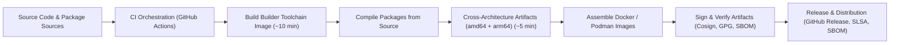

# System Architecture

## 1. Purpose

This document defines the authoritative architecture of the **UBI-9 Multi-Architecture Builder Toolchain** system.\
It describes the structural components, execution flows, trust boundaries, and design principles that govern how the platform produces **secure, reproducible, cross-architecture packages and container images**.

The architecture is explicitly designed to:

*   Maximize **build performance**
*   Enforce **reproducibility and determinism**
*   Enable **full source-based package provenance**
*   Minimize container image **vulnerability exposure**
*   Support **enterprise-scale CI/CD operations**
*   Guarantee **cryptographic signing, verification, and auditability**
*   Automate **governance, dependency management, and release engineering**

---

## 2. Architectural Objectives

| Objective       | Description                                                       |
| --------------- | ----------------------------------------------------------------- |
| Performance     | Builder image in \~10 minutes, multi-arch packages in \~5 minutes |
| Reproducibility | Deterministic toolchain and build outputs                         |
| Security        | Controlled provenance, signed artifacts, minimal attack surface   |
| Scalability     | Stateless, horizontally scalable CI execution                     |
| Portability     | Identical behavior across amd64 and arm64                         |
| Auditability    | Complete traceability of build and release lifecycle              |
| Automation      | End-to-end CI/CD, auto-update, and release workflows              |
| Governance      | Policy enforcement, PR hygiene, and compliance                    |

---

## 3. System Components

### 3.1 Source Layer

Includes:

*   Application source code
*   Package source code
*   Build scripts and configuration
*   Toolchain definitions (`tool-versions.json`)
*   CI/CD workflow definitions (`.github/workflows/`)

All downstream artifacts are derived from these sources.\
**Version pinning** is enforced for all critical tools and dependencies.

---

### 3.2 Builder Toolchain Image

**Base:** Red Hat UBI 9

Contains:

*   Compilers and linkers (GCC, Clang, LLD)
*   Cross-compilation toolchains (for arm64)
*   Build automation tooling (`make`, `jq`, `go`, etc.)
*   Strictly pinned versions defined in `/build/config/tool-versions.json`
*   Enterprise shell prompt and welcome banner (configurable at build time)

The builder image is constructed once per release cycle and reused for all package and image builds.

**Build time:** \~10 minutes

---

### 3.3 Build Orchestration Layer

Responsible for:

*   Coordinating toolchain assembly
*   Orchestrating package compilation (amd64 and arm64)
*   Managing build caches (Go, DNF, ccache)
*   Enforcing build invariants and deterministic execution (no environment drift)
*   Running smoke tests on produced binaries

Implements deterministic, reproducible, and auditable execution paths.

---

### 3.4 Package Compilation Layer

All packages are:

*   Compiled from source (no opaque binaries)
*   Built for **amd64** and **arm64** (cross-builds for ARM64)
*   Produced inside the controlled builder image
*   Free from external binary dependencies
*   Validated for architecture, permissions, and ELF headers

This layer is the primary contributor to the system’s low vulnerability profile.

**Build time:** \~5 minutes for multi-arch package set

---

### 3.5 Container Image Assembly

Runtime images are assembled using:

*   UBI 9 minimal base images
*   Only packages produced by this pipeline (no external binaries)
*   Automated SBOM (SPDX JSON) generation for every release

This produces minimal, auditable, low-vulnerability images suitable for production workloads.

---

### 3.6 CI/CD & Governance Layer

Implemented via **GitHub Actions** and supporting workflows:

*   **Toolchain build pipeline** (`build-toolchain.yml`)
*   **Builder image pipeline** (`build-image.yml`)
*   **Artifact signing and verification** (Cosign, GPG, SBOM, SLSA attestation)
*   **Release publication** (draft → latest, with auto-generated release notes)
*   **Security scanning** (CodeQL, Gitleaks, SARIF upload)
*   **PR governance** (checklist enforcement, semantic PR titles, auto-labeling)
*   **Automated dependency updates** (Dependabot, auto-update workflow for tool pins)
*   **Documentation, bug, feature, and task templates** for structured collaboration

All workflows are stateless, reproducible, and enforce strict policy and compliance.

---

## 4. End-to-End Execution Flow

All runtime images are assembled exclusively from pipeline-produced packages, enabling strict control and auditability.

---

## 5. Trust & Security Boundaries

| Boundary            | Controls                                                    |
| ------------------- | ----------------------------------------------------------- |
| Source → CI         | Access controls, PR governance, protected branches          |
| CI → Builder        | Immutable, containerized build environment                  |
| Builder → Artifacts | Cryptographic signing (Cosign, GPG), SBOM, SLSA attestation |
| Artifacts → Release | Signature verification, compliance checks, audit trail      |

No artifact is promoted without cryptographic validation and provenance.

---

## 6. Design Principles

*   **Source-first:** No opaque binaries; all software is built from source
*   **Deterministic by design:** Identical inputs produce identical outputs
*   **Minimal runtime footprint:** Only essential components in final images
*   **Performance as a first-class constraint:** Fast builds, optimized caching
*   **Security as a built-in property:** Signed, verified, and auditable artifacts
*   **Enterprise governance from inception:** Policy enforcement, PR hygiene, compliance
*   **Automation everywhere:** CI/CD, dependency updates, release engineering

---

## 7. Architectural Guarantees

The system guarantees:

*   Identical outputs for identical inputs (full reproducibility)
*   Reproducible builds across environments and runners
*   Consistent behavior on amd64 and arm64
*   Minimal vulnerability exposure in runtime images
*   Fully auditable artifact provenance (SBOM, SLSA, signed checksums)
*   Immutable, versioned releases with rollback and recovery
*   Automated, policy-driven governance and compliance

---

## 8. CI/CD & Release Automation (Implementation Highlights)

*   **Build & Release:**
    *   Cross-builds for amd64/arm64 using builder image
    *   Artifacts: `tools-linux-amd64.tar.gz`, `tools-linux-arm64.tar.gz`, SBOM, signatures, bundles
    *   Automated signing (Cosign, GPG), SBOM (Syft), SLSA attestation
    *   Draft → latest release with auto-generated notes and changelog categories
*   **Security:**
    *   CodeQL scanning for workflows
    *   Gitleaks secret scanning
    *   SARIF upload for code scanning dashboards
*   **Governance:**
    *   PR checklist and semantic title enforcement
    *   Auto-labeling and issue linking
    *   Dependabot and nightly auto-update for tool pins
*   **Release Engineering:**
    *   Immutable, versioned releases
    *   Rollback and recovery with full audit trail
    *   SLSA provenance for supply chain integrity

---

## 9. References

*   build-toolchain.yml
*   build-image.yml
*   auto-update.yml
*   pr-governance.yml
*   codeql.yml
*   security.yml
*   dependabot.yml
*   releases.yml

---

**This architecture establishes a new baseline for secure, high-performance, enterprise-grade multi-architecture build pipelines and low-vulnerability container image production.**

---
